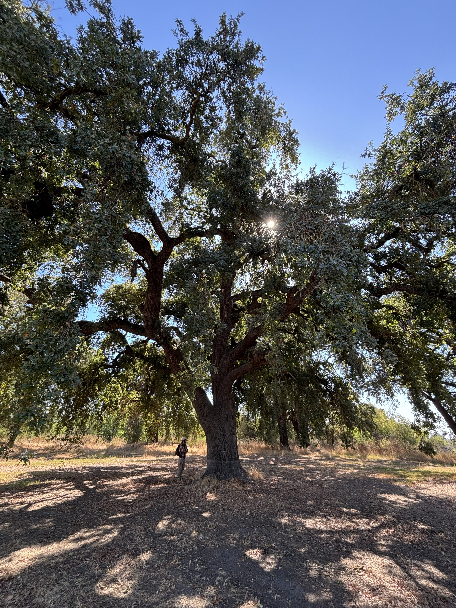
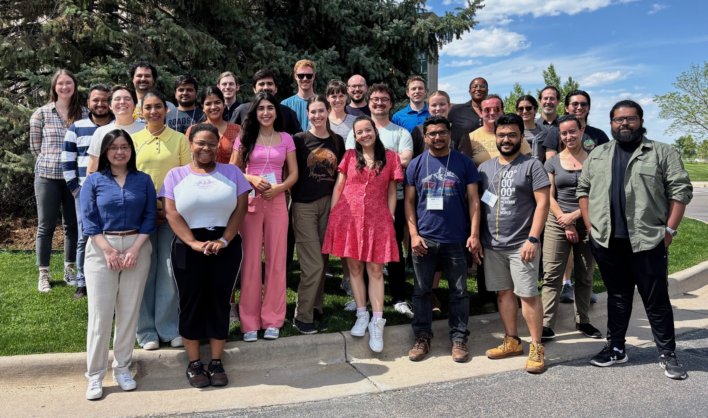
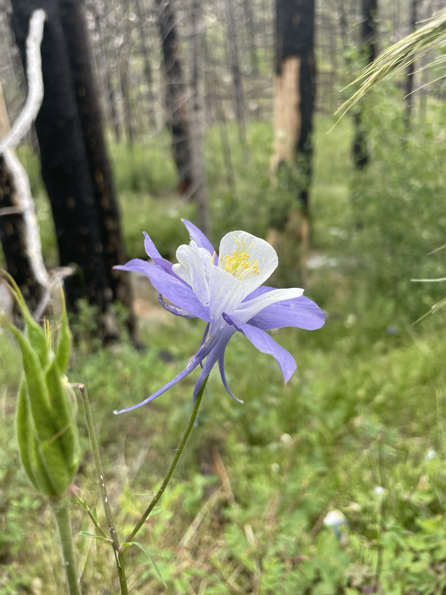

:::{.mostly-width-section}

::: {.blob-bg}
**March 2026:** Check out our latest publication about [strategies for assessing post-fire resilience](https://onlinelibrary.wiley.com/doi/10.1002/rra.70131) in River Research and Applications.
:::

<div style="height: 0.5rem;"></div>

::: {.blob-bg}
**January 2026:** Check out our latest publication about [large wood process domains and sample sizes](https://agupubs.onlinelibrary.wiley.com/doi/10.1029/2025JF008491) over space and time in the Journal of Geophysical Research: Earth Surface.
:::

<div style="height: 0.5rem;"></div>

::: {.blob-bg}
**December 2025:** I'm heading to AGU in New Orleans, LA to present on patterns of wood-induced pools. Come check out the Ecohydraulics and Ecomorphodynamics session on Wednesday, December 17th!
:::

<div style="height: 0.5rem;"></div>

::: {.blob-bg}
**November 2025:** Check out our newest publication about [decay state of large wood in channels and floodplains](https://doi.org/10.1002/esp.70186) out today in Earth Surface Processes and Landforms.
:::

<div style="height: 0.5rem;"></div>

::: {.blob-bg}
**October 2025:** I attended the [7th Symposium of the International Society for River Science](https://riversociety.net/) (ISRS) at the University of California, Davis. I presented research relating [bed configuration to in-channel wood](https://shaylatriant.github.io/shaylalovesrivers/projects/2025_5_WoodPools/index.html).
:::

<div style="height: 0.5rem;"></div>

::: {.blob-bg}
**July 2025:** Through the Advanced Studies Institute, I learned about *International Approaches to Freshwater Ecosystem Sustainability & Management* in Davis California, Trento, Italy, and Delft, Netherlands funded by the NSF.
:::

<div style="height: 0.5rem;"></div>

::: {.blob-bg}
**May 2025:** I participated in the [Earth Surface Process Institute (ESPIn)](https://csdms.colorado.edu/wiki/ESPIn) at CU Boulder focusing on numerical modeling and open source science practices.
:::

<div style="height: 0.5rem;"></div>

::: {.blob-bg}
**April 2025:** My MS thesis won the Warner College of Natural Resources [Outstanding Master's Thesis Award](https://warnercnr.source.colostate.edu/warner-college-2025-all-college-award-winners/)!
:::

<div style="height: 0.5rem;"></div>

::: {.blob-bg}
**April 2025:** The Tobacco Root Geological Society awarded a scholarship to complete additional fieldwork in Montana
:::

<div style="height: 0.5rem;"></div>

::: {.blob-bg}
**December 2024:** I presented research at AGU about [delineating logjam process domains](https://shaylatriant.github.io/shaylalovesrivers/projects/2024_12_LogjamProcessDomains/index.html) in Washington, D.C.
:::

<div style="height: 0.5rem;"></div>

::: {.blob-bg}
**September 2024:** Check out our most recent [publication in Geomorphology](https://doi.org/10.1016/j.geomorph.2024.109446) linking geomorphic characteristics across spatial scales to catchment-scale resilience
:::

:::


:::{.column-margin}
```{r}
#| echo: false

```
::: {.center-text .extra-small-text .dark-gray-text .bottom-br}
Tuolomne River floodplain during ISRS field trip
:::

<div style="height: 5rem;"></div>


:::{.column-margin}
```{r}
#| echo: false

```
::: {.center-text .extra-small-text .dark-gray-text .bottom-br}
2025 ESPIn cohort
:::

<div style="height: 5rem;"></div>


:::{.column-margin}
```{r}
#| echo: false

```
::: {.center-text .extra-small-text .dark-gray-text .bottom-br}
Colorado columbine during post-fire resilience field work
:::
