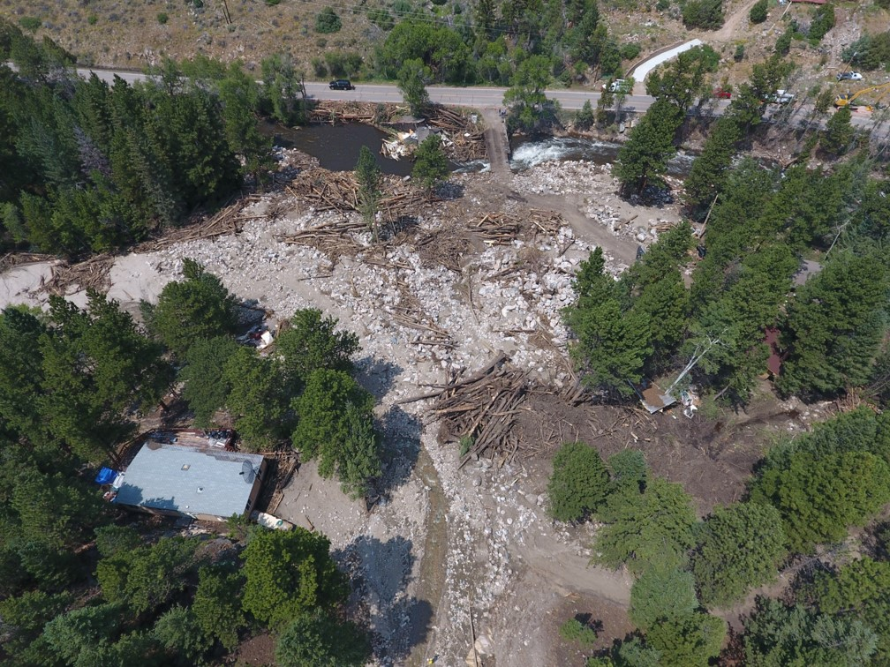
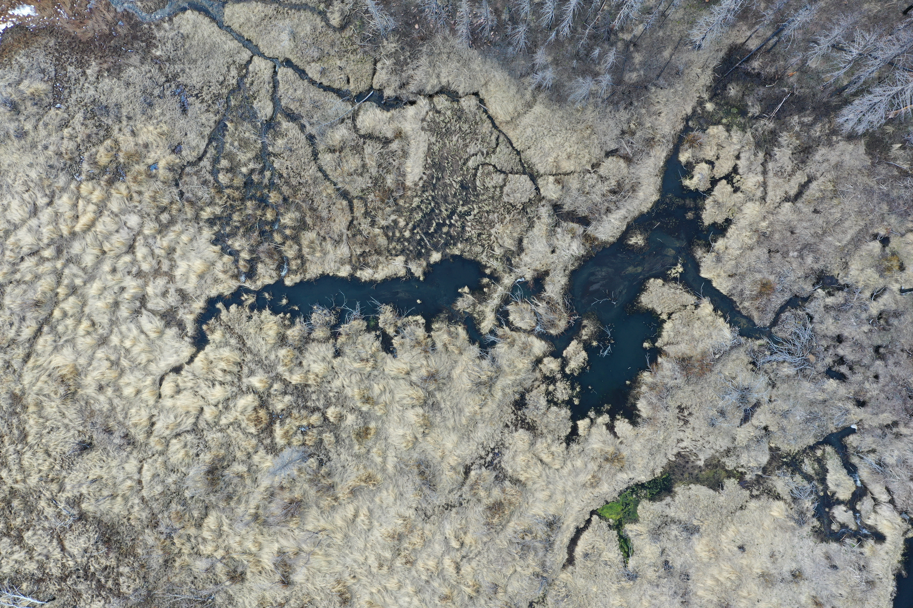
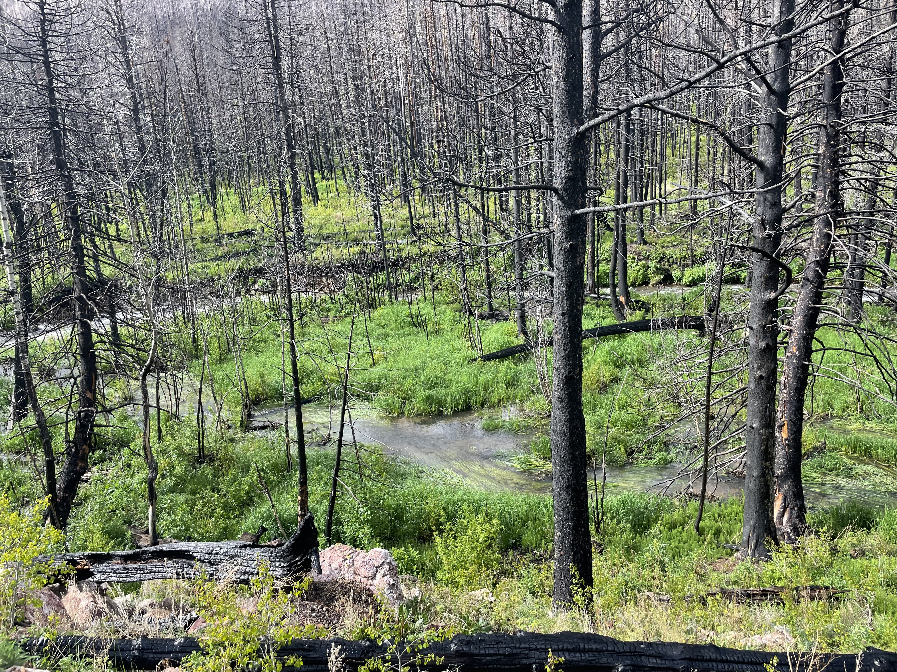

 Wildfire causes a cascade of disturbances that can dramatically alter river form, process, and ecosystem function. Understanding these changes to rivers helps determine when fire and flooding threaten water quality, infrastructure, and human life or when disturbance is part of a healthy landscape. 
 
---

::: {.title}

### Resilience to disturbance

:::

::: {.text-image-row}

::: {.row-text}
Our conceptualization of the wildfire disturbance cascade includes characteristics that drive and resist response to disturbance. As driving characteristics like burn extent or precipitation increase, we expect that a catchment would respond with a larger flood that causes more geomorphic change. This would indicate a less resilient catchment. The inverse is implied to be true, where we conceptulize resilience as increasing with increasing resisting characteristics. 
  
Within most of our seven study catchments, we found that more resilient catchments were made up of reaches with lower slopes, wider floodplains, more beaver berms and logjams, and more multi-stem deciduous vegetation like willow and alder.

***Read more about this project in [Geomorphology](https://doi.org/10.1016/j.geomorph.2024.109446) and on the Colorado Riparian Association [Green Line Blog](https://coloradoriparian.org/2024/01/09/a-watershed-is-more-than-the-sum-of-its-reaches-understanding-post-fire-resilience-at-different-scales/)***
:::

::: {.row-images}
{group="my-group"}

{group="my-group"}
:::

:::

---

::: {.title}
### Metrics for assessing post-fire response
:::

::: {.text-image-row .image-left .image-small}

::: {.row-text}
Following fire, geomorphic resilience can be assessed by monitoring many components of a catchment. We discuss characteristics of uplands and river corridors that can be assessed and methods for doing so. ***Read more about it in [River Research and Applications](https://onlinelibrary.wiley.com/doi/full/10.1002/rra.70131)***
:::

::: {.row-images}
{group="my-group"}
:::

:::

---

::: {.title}
### Publications
:::

**Triantafillou, S**, E Wohl. (2024). Geomorphic characteristics influencing post-fire river response 
in mountain streams, Geomorphology. https://doi.org/10.1016/j.geomorph.2024.1094467

Wohl, E, **S Triantafillou**, A Thornton-Dunwoody, C Mertz, K Larkin, W Keenan, S Griffin, D Davis, L Blehm. (2026). Strategies for assessing post-wildfire geomorphic resilience in semi-arid rivers, River Research and Applications. http://doi.org/10.1002/rra.70131

Wohl, E, A Marshall, **S Triantafillou**, M Mobley, R Morrison. (2024). Distribution of logjams in relation to lateral connectivity in the river corridor. Geomorphology. 

