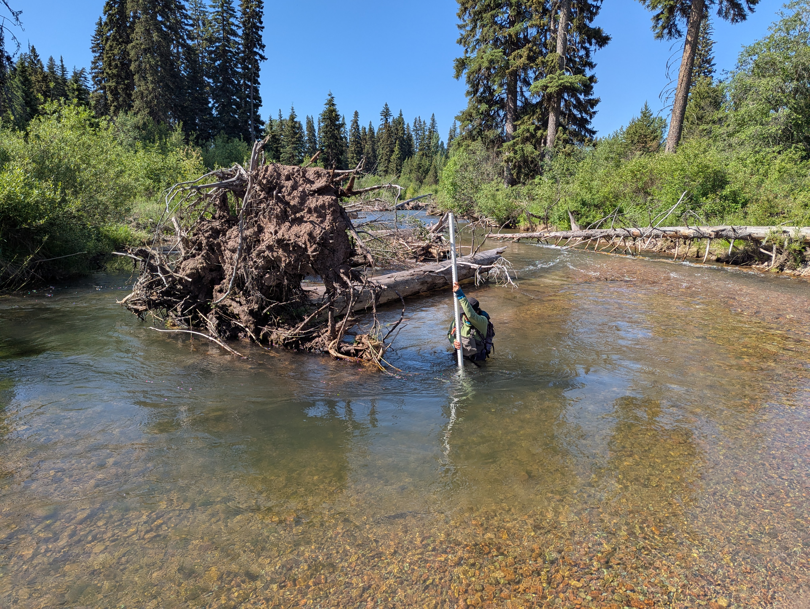
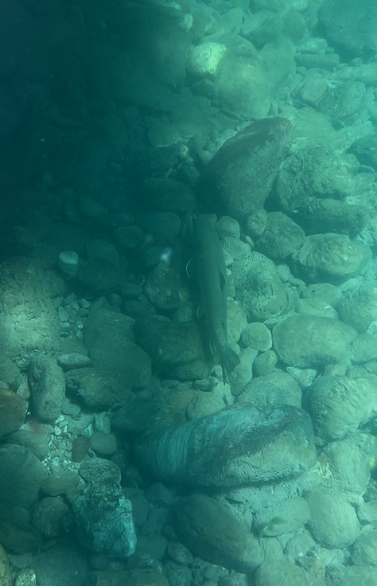

Logjams and large wood, formerly abundant in forested catchments, serve important roles ecologically, hydrologically, and geomorphically. Rivers with intact wood regimes lend insight into the dynamics of unaltered systems and can inform contemporary river restoration. 

---

::: {.title}
### Logjam distribution over space and time
:::

::: {.text-image-row .image-left .image-small}

::: {.row-text}
Logjams, formerly abundant in forested catchments, serve important hydrologic, geomorphic, and ecological roles. We delineated spatial and temporal domains for logjam storage in the Southern Rockies. Additionally, we explored the implications of these analyses with smaller datasets.

We found that elevation, morphology, and disturbance history acted as controls on the spatial distribution of logjams storage. When we iteratively decreased the sample size, we found that we were able to delineate these same spatial process domains using anywhere from 50-200 reaches rather than the full dataset of over 300 reaches. This implies that spatial controls on logjam storage could be identified for this region with substantially fewer than 300 reaches, which is a far more achievable sample size from a fieldwork perspective.

***Read more about it in [Journal of Geophysical Research: Earth Surface](https://agupubs.onlinelibrary.wiley.com/doi/full/10.1029/2025JF008491)***
:::

::: {.row-images}
{group="my-group"}
:::
:::
---

::: {.title}
### River bathymetry and wood
:::

::: {.text-image-row}

::: {.row-text}
Bedforms create critical habitat diversity for aquatic species. Habitat-driven management decisions often aim to create many pools for fish, especially species that require deep, slow water as flood refuge. While wood and quantity of pools has been shown across many regions, the relationship between wood and habitat quality is less well understood. 

***This work is in-progress, stay tuned for upcoming presentations and publications***

:::

::: {.row-images}
{group="my-group"}

{group="my-group"}
:::

:::

---

::: {.title}

### Publications

:::

Wohl, E, H Uno, SB Dunn, JT Kemper, A Marshall, M Means-Brous, JE Scamardo, **SP Triantafillou**. 
(2023). Why wood should move in rivers. River Research and Applications, 1–12. https://doi.org/10.1002/rra.411412 

Ockelford, A, E Wohl, V Ruiz-Villanueva, F Comiti, H Piégay, ..., **Triantafillou, S**,..., Aarnink, J. (2024). Working with wood in rivers in the Western United States. River Research and Applications, 1–16. https://doi.org/ 10.1002/rra.4331 

Marshall, A, RR Morrison, B Jones, **S Triantafillou**, E Wohl. (2024). Handheld LIDAR as a tool for characterizing wood‐rich river corridors. River Research and Applications. https://doi.org/10.1002/rra.4239

Wohl, E, A Marshall, **S Triantafillou**, M Mobley, R Morrison. (2024). Distribution of logjams 
in relation to lateral connectivity in the river corridor. Geomorphology. 
https://doi.org/10.1016/j.geomorph.2024.109100

**Triantafillou, S**, E Wohl. (2026). Evaluating the sensitivity of process domains for logjams to spatial and temporal sample size in river networks of the Southern Rockies, USA. Journal of Geophysical Research: Earth Surface. https://doi.org/10.1029/2025JF008491

**Triantafillou, S**, E Wohl, DN Scott, A Marshall. *In review.* Interacting effects of wood and 
channel geometry on pool depth in gravel-bed rivers. Earth Surface Processes and Landforms.

