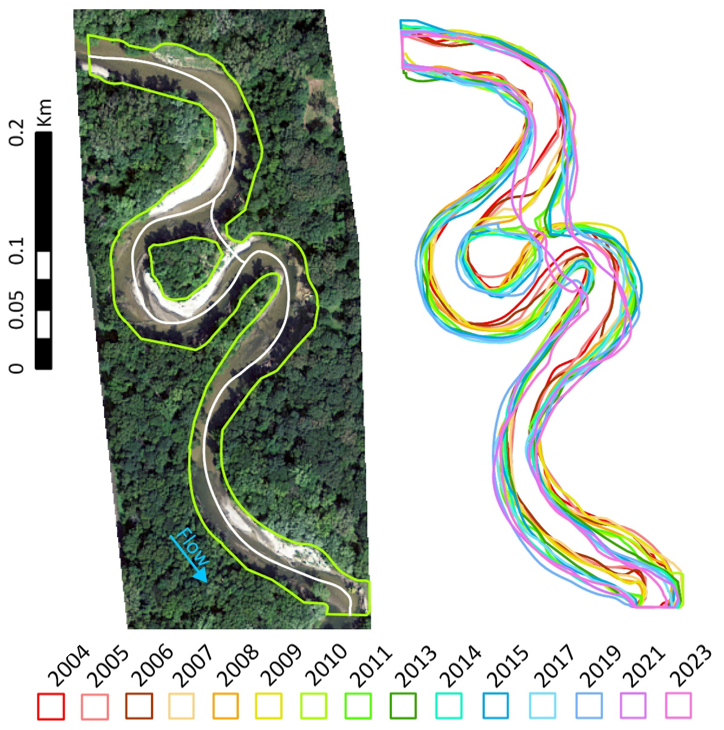
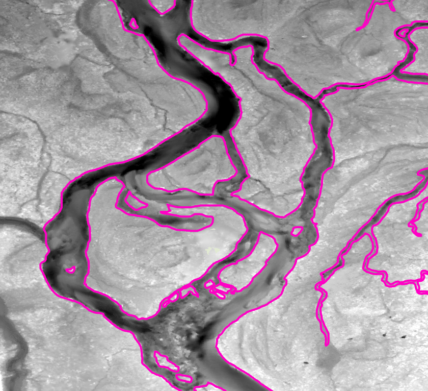
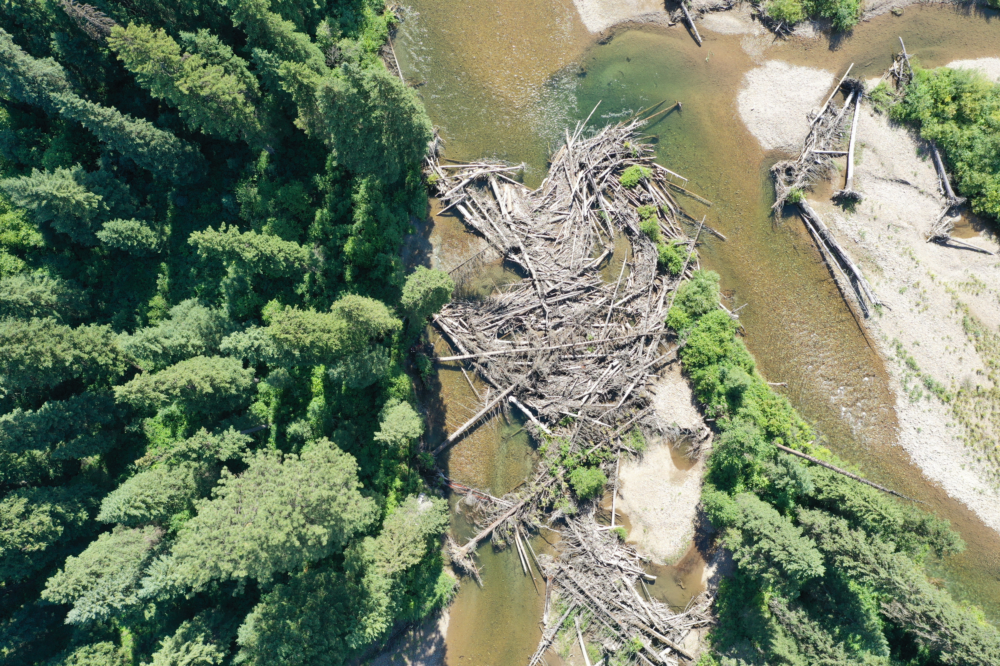

  Remote sensing often compliments river research, even projects primarily driven by data collection in the field. I use satellites, drones, and other methods to collect data on rivers from different angles. Some questions are best answered by studying rivers from above. 

---

::: {.title}
### River channel dynamism
:::
::: {.text-image-row .image-left .image-small}

::: {.row-text}
Almost 100 years of aerial imagery in Iowa show a persistent in-channel logjam in a dynamic section of river corridor. This inspired us to search for other locations to determine the impact of wood on river dynamics over space and time. Using aerial imagery records from sites across North America spanning up to 20 years, we found a relationship between the planview logjam area and the degree of channel dynamism within reaches of river corridor.

Additionally, we described two types of channel dynamism. Incremental channel adjustment occurs between most years of imagery as small magnitude changes. and episodic channel adjustment that occurs as large magnitude change more infrequently. Among our study sites, rivers that stored primarily individual pieces of wood were prone to incremental adjustment rather than episodic

*This work is in progress. Stay tuned for upcoming presentations and publications.*

:::

::: {.row-images}
{group="my-group"}
:::

:::

---

::: {.title}
### Topobathymetry of river beds
:::

::: {.text-image-row}

::: {.row-text}
Bedforms in rivers are produced by the interaction between hydraulic forces, bed material, and flow obstructions. Even though heterogeneous, wood-rich rivers serve as important habitat for a diversity of aquatic organisms, the controls on pool formation in these settings remain poorly understood. We are using almost 30 river km of bathymetric lidar to explore the controls on pool geometry in gravel-bed rivers. 

*This work is in progress. Stay tuned for upcoming presentations and publications.*

:::

::: {.row-images}
{group="my-group"}

{group="my-group"}
:::

:::

---

::: {.title}
### Publications
:::

Marshall, A, RR Morrison, B Jones, **S Triantafillou**, E Wohl. (2024). Handheld LIDAR as a tool for characterizing wood‐rich river corridors. River Research and Applications. [https://doi.org/10.1002/rra.4239](https://doi.org/10.1002/rra.4239)

